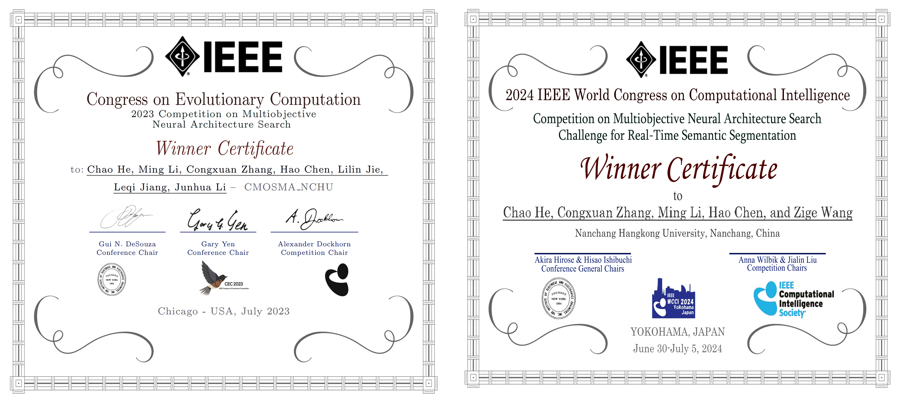

# RGCF: A Regularity-Guided Coevolutionary Framework for Multi-Objective Neural Architecture Search

This repository provides the source code associated with our paper **"A Regularity-Guided Coevolutionary Framework for Multi-Objective Neural Architecture Search"**.

It contains two representative instantiations of RGCF: CMOSMA_NCHU, winner of the IEEE CEC 2023 Competition on Multiobjective Neural Architecture Search, and GrSMEA_NCHU, winner of the IEEE WCCI 2024 Competition on Multiobjective Neural Architecture Search Challenge for Real-Time Semantic Segmentation.

## Implementation

Both instantiations are implemented on the **PlatEMO** platform, and the mNAS benchmark problems are provided by **EvoXBench**.

Before running the experiments, please install and configure EvoXBench according to its official instructions:

https://github.com/EMI-Group/evoxbench

## Dependencies

- MATLAB R2021
- PlatEMO
- EvoXBench

## Competition Awards

  

